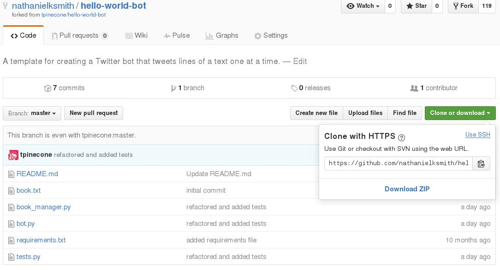

# Copy to PythonAnywhere

* 
Copy the HTTPS clone url for the fork (it should resemble https://github.com/[your_username]/hello-world-bot.git)
* 
Go back to the PythonAnywhere bash console and run ``git clone clone url`` where ``clone url`` is the web address you just copied.

##What did we just do?
"Cloning" a GitHub repo means taking some code that exists on GitHub and putting it somewhere that you can use and edit it. Here, we took your forked copy of the hello-world-bot template and put it on your PythonAnywhere server.

One thing you might be wondering is why we didn't just make a clone of the original hello-world-bot template. The reason is that only people who have been granted permission to a repository can push changes to it. By making a fork of hello-world-bot, you can push whatever changes you want to your fork without needing access to the original.