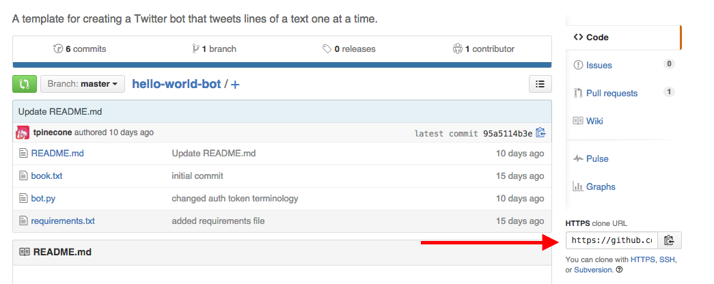

# Copy to PythonAnywhere

* 
Copy the HTTPS clone url for the fork (it should resemble https://github.com/[your_username]/hello-world-bot.git)
* 
Go back to the PythonAnywhere bash console and run ``git clone [clone url]``