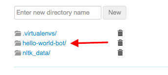
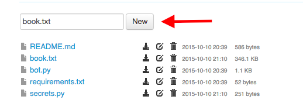

# Find a Book

We'll now need to find a book for our bot to tweet from. https://www.gutenberg.org/ has a wide selection of public domain books. Once you've found one, open the Plain Text version.
* 
Open the PythonAnywhere home page in a new tab and go to the "Files" section
* 
Create a file called book.txt inside the hello-world-bot directory and paste the text file into it (we could have created it in the bash console, but pasting large amounts of text into the browser bash console can cause problems).

* Then:

* 
Remove any extraneous text that you don't want to tweet, like the table of contents or appendix.

##What did we just do?
Project Gutenberg is a database of free books (the legal kind!). In order to run the hello-world-bot template, we need a text file called book.txt.
