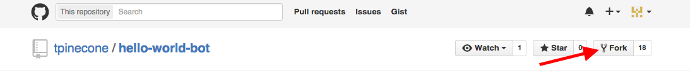

# Forking

* 
Fork the hello world bot template at https://github.com/tpinecone/hello-world-bot/ 

* 
By forking the hello world bot template, you'll be able to keep your bot and the changes you make to it separate from the original template repo.

##What did we just do...?

When you "fork" a GitHub repository, you're taking a project someone else has written (in this case, the hello-world-bot template), and creating a copy of it that you can make changes to. The changes you make on your fork won't affect the original repository. You can read more about forking <a href="https://guides.github.com/activities/forking/">here</a>.