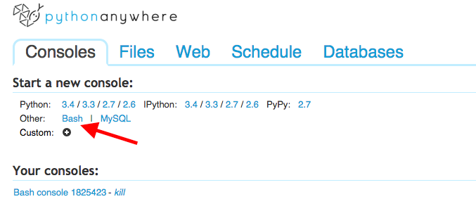

# Set up a PythonAnywhere account
* 
Sign up for PythonAnywhere at https://www.pythonanywhere.com/registration/register/beginner/
* 
Start a new bash console from the "Consoles" tab and leave it open, we'll come back to it later.

##What did we just do?
PythonAnywhere is a service for writing and hosting Python applications. We can put the code for our bot on PythonAnywhere, make changes to it, and tell it when to run. Without PythonAnywhere, this tutorial would need to have a lengthy chapter on how to install and use Python on all the different types of operating systems people might be using to create their bot.

There are a lot of different services out there for hosting web applications with their own pros and cons. We're using PythonAnywhere because it has a fairly simple UI, it allows us to write Python programs from the browser, and it's free. If you're more experienced at programming, you might be interested in checking out <a href="https://www.heroku.com/">Heroku</a>, <a href="https://www.digitalocean.com/">Digital Ocean</a>, and <a href="http://aws.amazon.com/">AWS</a> for deployment. Those  are services with more options, but are a little harder to use than PythonAnywhere.