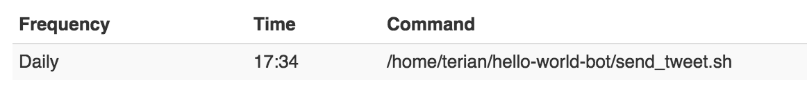

# Set up scheduling
We're going to make a shell script which PythonAnywhere will execute on a schedule. A free account is only allowed to run one scheduled task per day, but if you want to tweet more than that you can get unlimited scheduled tasks for about $5 per month on PythonAnywhere or other hosting services like Digital Ocean. You can read more about choosing and configuring hosting at [BotWiki](https://botwiki.org/tutorials/).

For our free once per day bot,
* Add a file called send_tweet.sh to the hello-world-bot directory with the following contents:
```sh
#!/bin/bash
cd /home/$USER/hello-world-bot/
python3 bot.py
```
* 
On the bash console, make sure you're in the hello-world-bot directory and run 
```sh
chmod +x send_tweet.sh
```
This will give PythonAnywhere permission to run the script.
* 
Visit the "Schedule" tab on PythonAnywhere
* Add a new scheduled task which points to /home/[your username]/hello-world-bot/send_tweet.sh and runs within the next couple of minutes. 
* You'll be able to tell if the scheduled task is working correctly if a tweet is posted at the time you configured it for. If something went wrong, you can remove the task and set it up again with a different time.
