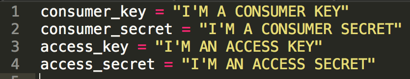

* 
Create an account for the bot at https://twitter.com/signup. (don't worry about picking a perfect username, it can be changed later).
* Note: if you've created a Twitter account before, you won't be allowed to use the same phone number to sign up for a new account. You can sign up for a free phone number at https://www.google.com/voice that will forward to your existing number.
* 
Visit https://apps.twitter.com/app/new to create a new Twitter application for this account.
* 
Once you have created an application for your account, visit the Keys and Access Tokens section.
* Generate a new access token.

We will now take the authorization credentials we have just received and put them in a secrets.py file. This will be used to authenticate with Twitter.

* 
Go back to our PythonAnywhere bash console
* 
Add a secrets.py file to the hello-world-bot directory. It should resemble this:
