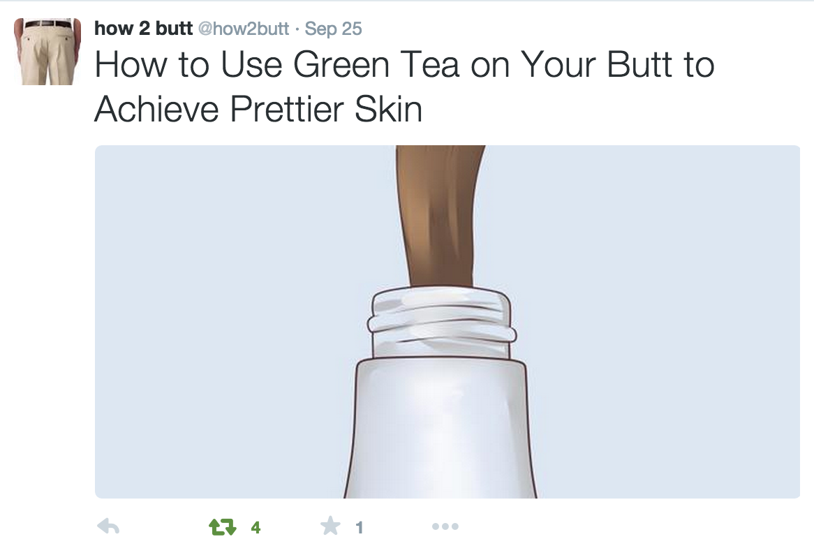
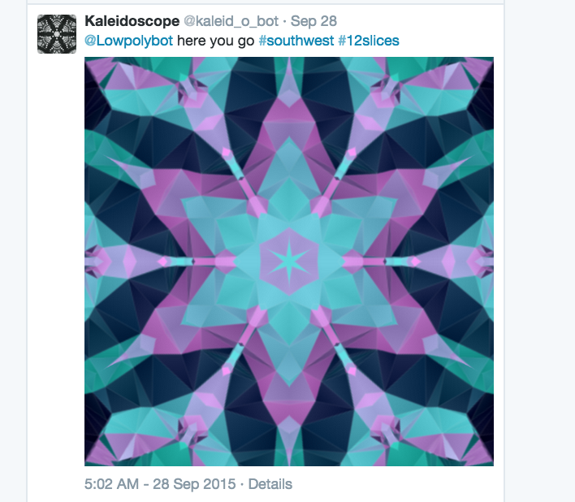

# What is a Twitter bot?
A Twitter bot is any kind of program that posts generated content to Twitter, either on a regular schedule or in response to something. They can be funny or insightful or beautiful or anything else you can think of.

# Why should I make one?
Because of their simplicity, bots are a fun project for anyone 